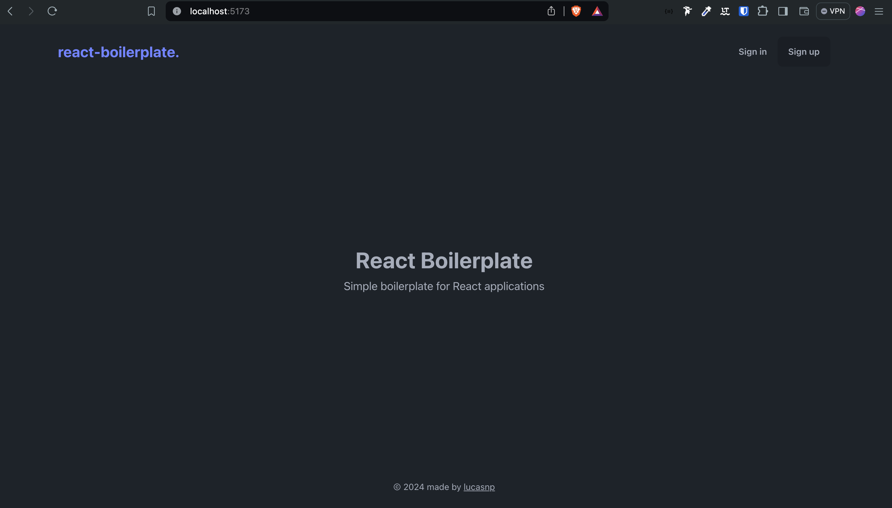

# React Boilerplate

A minimal and efficient boilerplate for building React applications.



## Features

- **UI Framework**: Styled components with [DaisyUI](https://daisyui.com/), a plugin for Tailwind CSS.
- **Authentication**: Secure authentication using [Kinde](https://kinde.com/).
- **Internationalization**: Multi-language support with [i18next](https://www.i18next.com/).

## Getting Started

### Prerequisites

Make sure you have the following installed:

- [Node.js](https://nodejs.org/) (version 14 or higher recommended)
- [npm](https://www.npmjs.com/)

### Installation

1. **Clone the repository:**

    ```bash
    git clone https://github.com/lucasnevespereira/react-boilerplate.git
    cd react-boilerplate
    ```

2. **Install dependencies:**

    Using npm:
    ```bash
    npm install
    ```

### Running the Application

To start the development server, run:

```bash
npm run dev
```

